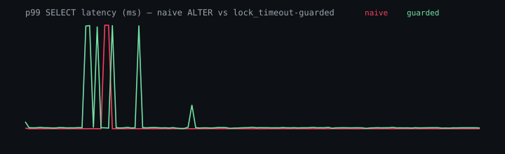

# gitdb — version control for a live Postgres schema

Branch a 5 GB Postgres database in milliseconds, *with all the data*. Evolve
the schema in the branch, diff it semantically, validate the change against
real rows, then merge it into `main` as a lock-timeout-guarded expand-and-contract
migration.

> The live instance is intended to run on this workstation through a **named**
> tunnel. No named-tunnel credentials are configured on this machine yet, so
> there is no stable public URL in this README. If a reviewer cannot reach a
> deployed host, `docker compose up` reproduces the app locally, and the
> lock-proof numbers below stand in for the runtime demo until a video is
> recorded.

## 60-second quickstart

```bash
docker compose up --build
# first boot seeds ~25 M rows (skip if the volume already has data)
# UI:  http://localhost:5173
# API: http://localhost:8080/api/health
```

If those host ports are already taken by a local `npm run dev`:

```bash
API_PORT=18080 WEB_PORT=18081 docker compose up --build
```

Dev loop without Docker for the app (Postgres still from compose):

```bash
docker compose up -d db
npm install
node infra/seed.mjs          # no-ops if main.txns already has rows
cd api && npm run dev        # :3001
cd web && npm run dev        # :5173, proxies /api to the API
```

```bash
npm test                     # 91 Vitest cases, including lock-contention + backfill-race
node infra/proof.mjs         # naive vs guarded lock chart
```

## What you are looking at

- A branch is a schema of views over `main`. Creating one does not copy the
  5 GB table. Measured: **4 ms, 0 bytes**, ~0% query overhead.
- Diff is structural over a canonical catalog IR, not a text diff of `pg_dump`.
- `REWRITE` changes expand, sync (trigger), backfill, validate, then cut over.
  Contract — the only destructive step — is a separate, manual action.
- Every DDL statement except `CREATE INDEX CONCURRENTLY` runs through
  `lock_timeout = 500ms` and retries. A second merge is refused with
  `409 { state: "merge_in_progress" }`.

## The proof

20 concurrent point lookups while a transaction holds `AccessShareLock` for 6 s.
Same `ALTER TABLE … TYPE` on both sides. Reproduced by `node infra/proof.mjs`.

| Path | ALTER outcome | p50 | p99 | max |
|---|---|---:|---:|---:|
| Naive (no lock_timeout) | queued **5,646 ms** | 2.3 ms | 6.4 ms | **5,644 ms** |
| Guarded (`lock_timeout=500ms`) | acquired after 6 retries | 2.9 ms | 7.0 ms | **505 ms** |



p99 stays low because most of the 16 s window is quiet. The number that
matches the thesis is **max**: naive readers sat behind the queued `ALTER`
for the full 5.6 s; guarded readers never waited longer than the 500 ms
timeout.

Earlier, on the real 20 M-row / 4 GB table: an unguarded `SELECT` behind
`ALTER TABLE` blocked **3,098 ms** then timed out; the same DDL with
`lock_timeout` aborted in **605 ms**.

## Tests

Unit (no database): canonical hashing, structural diff, risk classification,
rename suggestions, three-way merge, plan compiler.

Integration (this Postgres): branch create/retry/recreate, views surviving
parent DDL, expand→backfill→cutover preserving every row, mid-backfill
resume, revert restoring the original IR hash, lock-contention, backfill
race (fails without the sync trigger).

```
cd api && npx vitest run    # 91 tests / 16 files
```

## Deploy

Compose is the deployment artifact. systemd units live in `infra/systemd/`:

```bash
sudo cp infra/systemd/gitdb.service /etc/systemd/system/
sudo systemctl enable --now gitdb.service
```

For a **named** public URL (quick tunnels rotate and are not acceptable):

- Cloudflare named tunnel → `gitdb.<your-domain>`
- Tailscale Funnel → `box.tailnet.ts.net`

`infra/systemd/gitdb-tunnel.service` is a placeholder. Fill in `ExecStart`
once the named tunnel exists. Also disable suspend on the host so a reviewer
does not hit a sleeping laptop:

```bash
gsettings set org.gnome.settings-daemon.plugins.power sleep-inactive-ac-type 'nothing'
sudo systemctl mask sleep.target suspend.target hibernate.target hybrid-sleep.target
```

## Honest boundaries

- This versions **schemas**, not row history. After contract, dropped column
  data is gone. Revert is lossless until then.
- Branch constraints/indexes are *declared* and validated against real rows;
  they are enforced on merge, not inside the branch.
- SQL authoring is the Task 18 DDL whitelist, not every PostgreSQL feature.
- Demo video is not recorded yet. The lock chart and the test suite are the
  durable evidence until it is.

See `decisions.md` for the why, `PLAN.md` for the measured hypotheses, and
`BUILD.md` for the executable spec.
